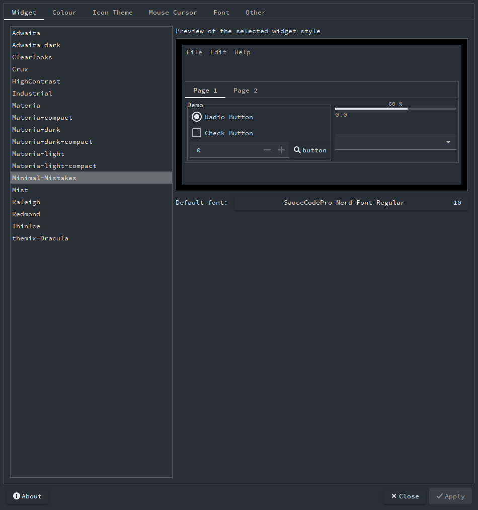

# Minimal-Mistakes for [GTK](https://www.gtk.org/)

> A dark theme for [GTK](https://www.gtk.org/).
> 
> This theme provides support for GTK-3 and GTK-2 based desktop environments like Gnome, Unity, Budgie, Pantheon, XFCE, Mate, etc. Also provides support for KDE plasma.

## Install

All instructions can be found at [minimalmistakes.org/gtk](https://minimalmistakes.org/apps/themes/gtk).

## Team

This theme is maintained by the following person(s) and a bunch of [awesome contributors](https://github.com/minimal-mistakes/kitty/graphs/contributors).

|  |
| ------------------------------------------------------------------------------------------------------------------ |
| [Minimal-Mistakes](https://github.com/Minimal-Mistakes)                                                            |

## License

[MIT License](./LICENSE)
